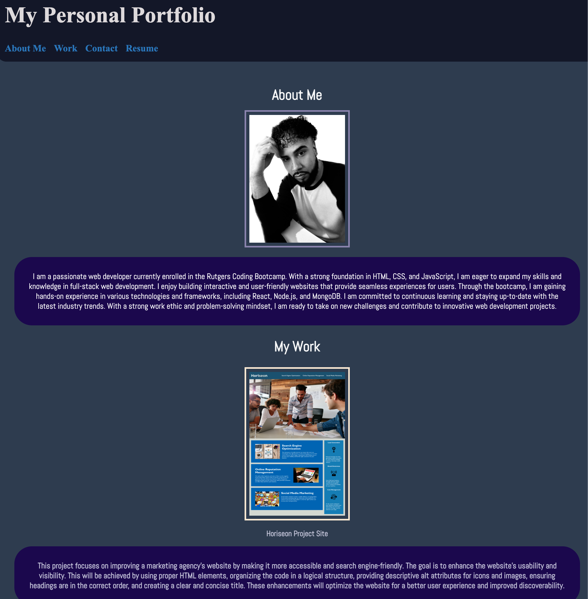

# mydev_portfolio

Personal development portfolio website showcasing my web development skills, projects, and experience.

Welcome to My Portfolio! This project showcases my skills, projects, and contact information in a single-page web application. It serves as a central hub for potential employers or clients to learn more about my work and get in touch with me.

## Table of Contents

- [Description](#description)
- [Features](#features)
- [Technologies Used](#technologies-used)
- [Setup and Usage](#setup-and-usage)
- [License](#license)

## Description

My Portfolio is a web application designed to present my portfolio of work samples to employers and clients. It provides an overview of my skills, showcases my projects, and offers a contact section for inquiries.

The project is built using standard HTML, & CSS. It incorporates responsive design techniques, including the use of flexbox and media queries, to ensure optimal viewing experience across various devices and screen sizes.

SITE URL: https://mkyrene.github.io/mydev_portfolio/

## Features

- Introduction section with a welcome message and brief description
- About Me section highlighting my background and skills
- Work section showcasing my projects with descriptions and links to view them
- Contact section with a contact form for inquiries and social media links
- Responsive layout that adapts to different viewport sizes

## Technologies Used

- HTML
- CSS

## Setup and Usage

1. Clone the repository: `git clone https://github.com/MKYRENE/mydev_portfolio.git`
2. Open the index.html file in a web browser.
3. Customize the content of each section in the HTML file to reflect your own information.
4. Modify the CSS file to apply your desired styles and design.
5. Add your own project images, descriptions, and links to the work section.
6. Update the contact form to include your preferred email address or form handling logic.
7. Customize the social media links with your own profiles.
8. Deploy the website to a hosting platform or share the index.html file directly.

Feel free to modify and adapt the project according to your preferences and needs.

## License

This project is licensed under the [MIT License](LICENSE).
